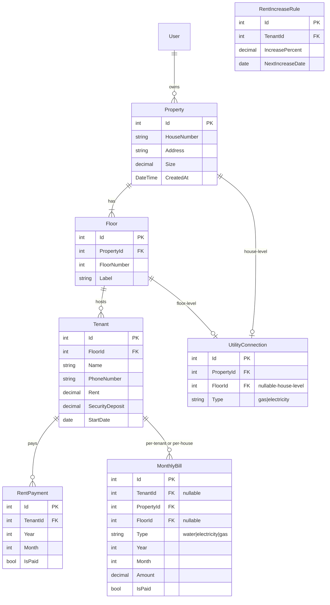

# Property & Tenant Management System — Specification

## 1. Overview

### 1.1 Purpose

A system for managing rental properties, their floors, tenants, utility bills, and rent. It supports properties with multiple floors, each of which may have shared (house-level) or separate (floor-level) gas and electricity connections.

### 1.2 Tech Stack

| Layer        | Technology                                     |
| ------------ | ---------------------------------------------- |
| Backend      | ASP.NET Core Minimal APIs (.NET 10)            |
| Data Access  | Entity Framework Core Model First (Code First) |
| Frontend     | React + Vite + TypeScript                      |
| UI Framework | Bootstrap                                      |

---

## 2. Authentication & Navigation

### 2.1 Entry Point

- **Login screen** — First screen; user must authenticate before accessing the app.

### 2.2 Post-Login Flow

- **Dashboard** — Main landing page after login.
- Displays properties as **cards** with CRUD actions.
- Navigation to property details, floors, tenants, and billing.

---

## 3. Data Model (Entity Classes & DbContext)

For **EF Core Model First (Code First)**, C# entity classes and a `DbContext` define the model. EF Core migrations generate and update the database schema.

### 3.1 Entity Relationship Diagram

### 3.2 Entity Definitions

#### Property

| Column      | Type     | Notes              |
| ----------- | -------- | ------------------ |
| Id          | int      | PK, auto-increment |
| HouseNumber | string   |                    |
| Address     | string   |                    |
| Size        | decimal  | Property size      |
| CreatedAt   | DateTime |                    |

#### Floor

| Column      | Type   | Notes                                 |
| ----------- | ------ | ------------------------------------- |
| Id          | int    | PK                                    |
| PropertyId  | int    | FK → Property                         |
| FloorNumber | int    |                                       |
| Label       | string | Optional label (e.g. "Ground", "1st") |

#### Tenant

| Column          | Type     | Notes              |
| --------------- | -------- | ------------------ |
| Id              | int      | PK                 |
| FloorId         | int      | FK → Floor         |
| Name            | string   |                    |
| PhoneNumber     | string   |                    |
| Rent            | decimal  | Monthly rent       |
| SecurityDeposit | decimal  |                    |
| StartDate       | DateTime | Tenancy start date |

#### UtilityConnection

Connections can apply to the whole house or a specific floor.

| Column     | Type   | Notes                                      |
| ---------- | ------ | ------------------------------------------ |
| Id         | int    | PK                                         |
| PropertyId | int    | FK → Property                              |
| FloorId    | int?   | Null = house-level; non-null = floor-level |
| Type       | string | `"gas"` or `"electricity"`                 |

#### MonthlyBill

Bills can be at house/floor level (shared) or tenant level (separate meter).

| Column     | Type    | Notes                                     |
| ---------- | ------- | ----------------------------------------- |
| Id         | int     | PK                                        |
| TenantId   | int?    | Null = shared; non-null = tenant-specific |
| PropertyId | int     | FK → Property                             |
| FloorId    | int?    | For floor-level shared bills              |
| Type       | string  | `"water"`, `"electricity"`, `"gas"`       |
| Year       | int     |                                           |
| Month      | int     |                                           |
| Amount     | decimal |                                           |
| IsPaid     | bool    |                                           |

#### RentPayment

| Column   | Type | Notes       |
| -------- | ---- | ----------- |
| Id       | int  | PK          |
| TenantId | int  | FK → Tenant |
| Year     | int  |             |
| Month    | int  |             |
| IsPaid   | bool |             |

#### RentIncreaseRule

| Column           | Type     | Notes                        |
| ---------------- | -------- | ---------------------------- |
| Id               | int      | PK                           |
| TenantId         | int      | FK → Tenant (1:1)            |
| IncreasePercent  | decimal  | Default 10%, user adjustable |
| NextIncreaseDate | DateTime | When next increase applies   |

---

## 4. Core Functionalities

| Area              | Operations                                                                                    |
| ----------------- | --------------------------------------------------------------------------------------------- |
| **Properties**    | Full CRUD; card layout on dashboard                                                           |
| **Floors**        | CRUD per property; floor number and label                                                     |
| **Tenants**       | CRUD per floor; name, phone, rent, start date, security deposit                               |
| **Monthly Bills** | List water, electricity, gas; show paid/unpaid; house vs tenant level (more detail in future) |
| **Rent Payments** | List monthly rent and paid status                                                             |
| **Rent Increase** | Year completion date; 10% default (adjustable); notification before last month                |

---

## 5. API Design (Minimal APIs)

Endpoints implemented as Minimal APIs (no Controllers).

### 5.1 Endpoint Summary

| Resource      | Endpoints                                                                                                                                        |
| ------------- | ------------------------------------------------------------------------------------------------------------------------------------------------ |
| Auth          | `POST /api/auth/login`                                                                                                                           |
| Properties    | `GET /api/properties`, `POST /api/properties`, `GET /api/properties/{id}`, `PUT /api/properties/{id}`, `DELETE /api/properties/{id}`             |
| Floors        | `GET /api/properties/{id}/floors`, `POST /api/properties/{id}/floors`, `GET /api/floors/{id}`, `PUT /api/floors/{id}`, `DELETE /api/floors/{id}` |
| Tenants       | `GET /api/floors/{id}/tenants`, `POST /api/floors/{id}/tenants`, `GET /api/tenants/{id}`, `PUT /api/tenants/{id}`, `DELETE /api/tenants/{id}`    |
| Bills         | `GET /api/properties/{id}/bills?year=&month=`                                                                                                    |
| Rent Payments | `GET /api/tenants/{id}/payments`                                                                                                                 |
| Rent Increase | `GET /api/tenants/{id}/rent-increase`, `PUT /api/tenants/{id}/rent-increase`                                                                     |

### 5.2 DTOs / Request/Response Shapes

(To be defined during implementation.)

---

## 6. Frontend (Bootstrap)

- Add **Bootstrap** via npm to `tenants.client`.
- **Login**: Centered form, primary button.
- **Dashboard**: Grid of property cards (`card`, `card-body`), add/edit/delete actions.
- **Property detail**: List of floors, list of tenants, bills summary.
- **Tables**: For tenants, floors, bills use Bootstrap `table`, `table-striped`.
- **Forms**: Use modals for create/edit where appropriate.

---

## 7. Rent Increase Logic

- **NextIncreaseDate** = `Tenant.StartDate + 1 year`, then annually thereafter.
- Default **IncreasePercent** = 10%; user can change per tenant.
- **Notification**: Show alert/badge when current month is the month before `NextIncreaseDate` (i.e. one month before rent increase is due).

---

## 8. Future / Out of Scope (For This Phase)

- Detailed monthly bill logic (water/electricity/gas per meter type).
- Full user management (assume single user or simple auth).
- Advanced reporting and analytics.

---

## 9. Implementation Order

1. Define entity classes and DbContext → run EF Core migrations to create database.
2. Auth (simple login) and Minimal API wiring.
3. Properties CRUD (API + UI).
4. Floors CRUD per property.
5. Tenants CRUD per floor.
6. Rent payments and monthly bills (basic list).
7. Rent increase rules and notifications.
8. Bootstrap polish and UX refinements.
